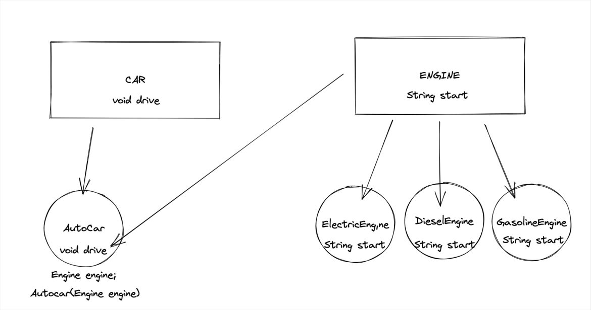

"Dependency injection is one of the most commonly used Inversion of Control methods in the Java programming language. In this work, I have given you an example of this.
The AutoCar class is implemented in the Car class and in the engine subclasses. The AutoCar class has a dependency on the Engine class's methods. To get rid of this dependency, the following flow is followed."

